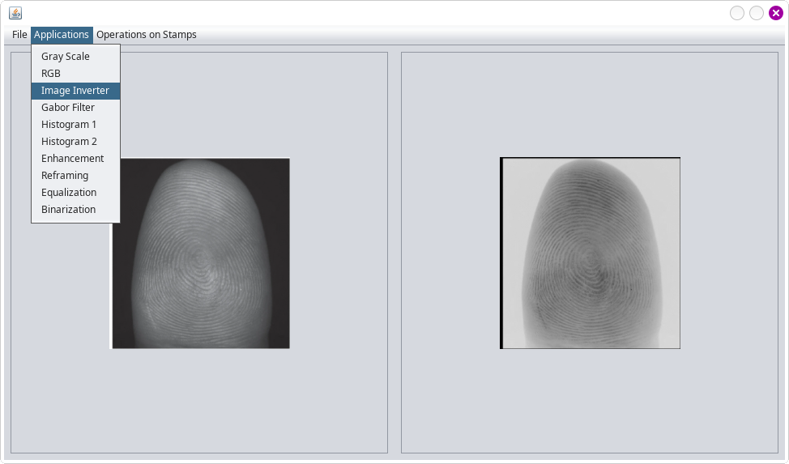
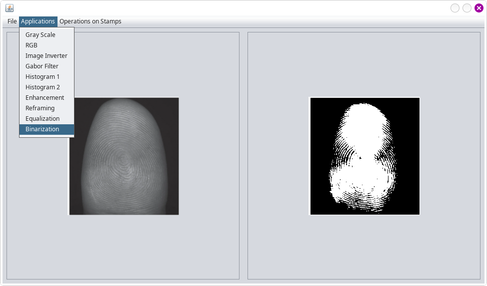
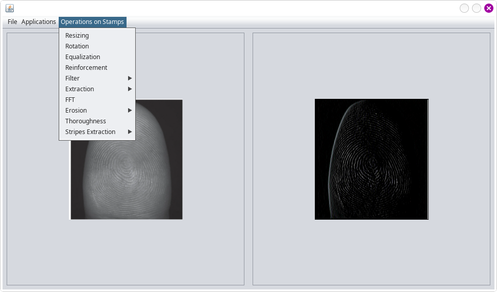

## fingerprint with contact processing app
This is a java built app with GUI.

## How to test
- Run the app (with netbeans or intellij, for example).
- Choose a fingerprnt image (**./contactless_fingerprint.png** for example) or any other images you want (**./cute_image.jpg**). The chosen image will appear at the **left** frame.
- Apply any available image processing function (some examples below). The processed image will appear at the **right** frame.
- In the menu, you have the option of **saving the processed image** so that you can choose it as the main image for applying other functions.

\
**fig.: Image color inversion.**

\
**fig.: Fingerprint binarization.**

\
**fig.: Sobel XY filter applying.**